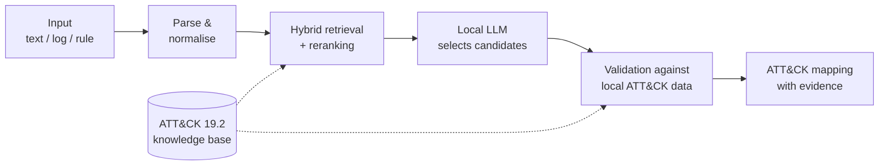

[English](README.md) | [Türkçe](README.tr.md)

# MITRE ATT&CK Technique Mapping Platform

A local LLM + RAG application that maps security events — natural-language incident
descriptions, raw Windows/Sysmon/QRadar logs and detection-rule text — to MITRE
ATT&CK tactics, techniques and sub-techniques, and shows the evidence behind every
result.

Retrieval proposes candidates; a validation layer decides what survives. Everything
runs locally through [Ollama](https://ollama.com/); security event content is not
sent to a hosted LLM API.

**Project purpose:** This is an independent engineering project built for learning
and experimentation. It explores local LLMs, RAG, MITRE ATT&CK validation, and
security-event mapping through hands-on implementation and measurement.

## Screenshots


*Single-event analysis of a synthetic `schtasks /create` log: the verdict, its
reason chain and the mapped techniques with their evidence (the interface is in
Turkish).*


*The validation tab of the same run: techniques the model proposed but the evidence
did not support are removed, each with its reason.*


*Bulk mode on a sample CSV: per-row results, with related rows grouped into an
incident.*

## What it does

- **Single-event analysis** — takes free text, a raw log line or a detection rule and
  returns ATT&CK techniques and sub-techniques, each with its evidence, a confidence
  score and the official MITRE detection and mitigation guidance.
- **Bulk analysis and incident correlation** — takes a log file or a QRadar CSV
  export, analyses each row, and groups related rows into incidents with an attack
  chain, timeline, IOC summary, risk score, Markdown report and a *draft* QRadar rule.
- **Evaluation** — a 60-scenario benchmark comparing a baseline and an improved
  pipeline.

## Architecture



Retrieval only builds a candidate pool; the local model chooses from it, and code
checks every choice against the local ATT&CK dataset. Validation can remove a
technique but never add one. Details:
[`docs/architecture.md`](docs/architecture.md).

## Key features

- Hybrid retrieval (vector + keyword search) with cross-encoder reranking
- Validation against the local ATT&CK Enterprise 19.2 dataset, including revoked and
  deprecated techniques
- Validation agents that can confirm, downgrade or reject — never add
- Confidence computed from measurable signals, not taken from the model
- Deterministic incident correlation with attack chain, timeline and risk score
- QRadar rule drafts built from validated evidence, never written by the model
- Fully local inference

## Quick Start

Requires [Ollama](https://ollama.com/) installed and running.

```
ollama pull qwen3:8b
ollama pull bge-m3

python -m venv .venv
.venv\Scripts\activate            # Linux / macOS: source .venv/bin/activate
pip install -r requirements.txt
copy .env.example .env            # Linux / macOS: cp .env.example .env

# build the ATT&CK knowledge base and indexes (one time, ~30 min)
python scripts/download_attack_data.py
python scripts/parse_stix.py
python scripts/build_chunks.py
python scripts/build_index.py

streamlit run app/ui/streamlit_app.py
```

Run the tests with `pytest` (1,501 tests; 11 skipped in a public clone). Full setup,
GPU notes and command-line usage: [`docs/setup-and-usage.md`](docs/setup-and-usage.md).

## Results

Controlled benchmark on ATT&CK Enterprise 19.2, 60 scenarios:

| Metric | Baseline | Improved |
|---|---:|---:|
| Mean hierarchical score | 0.660 | 0.672 |
| Top-1 exact accuracy | 61.7% | 64.9% |
| Recall@10 | 0.810 | 0.800 |
| Hallucinated ATT&CK IDs | 0 | 0 |
| Correct abstention | 100% | 100% |

Methodology, all metrics and per-category results:
[`docs/evaluation.md`](docs/evaluation.md).

## Known limitations

- For benign inputs the system raises no alert but still lists low-confidence
  technique suggestions instead of an empty answer.
- Analysis runs on a small local model and takes minutes per event on a consumer GPU.
- The detection-rule catalogue still has open gaps; see
  [`docs/engineering-notes.md`](docs/engineering-notes.md).
- The interface is Streamlit only; there is no API.

## Documentation

| Document | Contents |
|---|---|
| [`docs/architecture.md`](docs/architecture.md) | pipeline diagrams, design principles, worked example |
| [`docs/evaluation.md`](docs/evaluation.md) | benchmark method, full results, historical runs, performance |
| [`docs/attack-19.2-migration.md`](docs/attack-19.2-migration.md) | ATT&CK 19.1 → 19.2 data changes and controlled comparison |
| [`docs/setup-and-usage.md`](docs/setup-and-usage.md) | installation, GPU notes, CLI usage, project structure, privacy |
| [`docs/engineering-notes.md`](docs/engineering-notes.md) | method, findings, disproved hypotheses, status, future work |
| [`docs/`](docs/) `beklenti_*` / `olcum_*` / `sonuc_*` | per-task expectations, measurements and outcomes (Turkish) |

## License

MIT — see [LICENSE](LICENSE).
