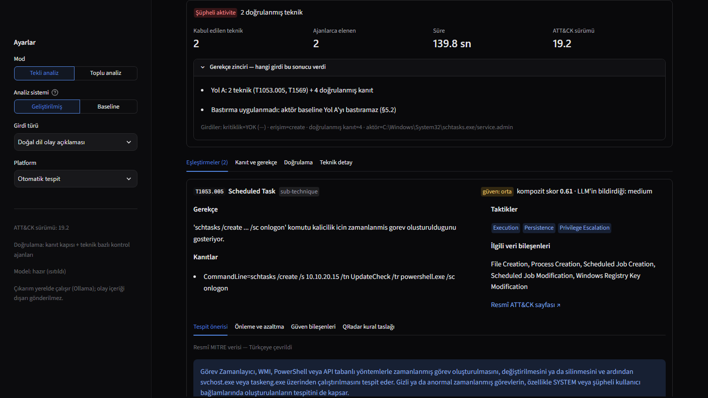
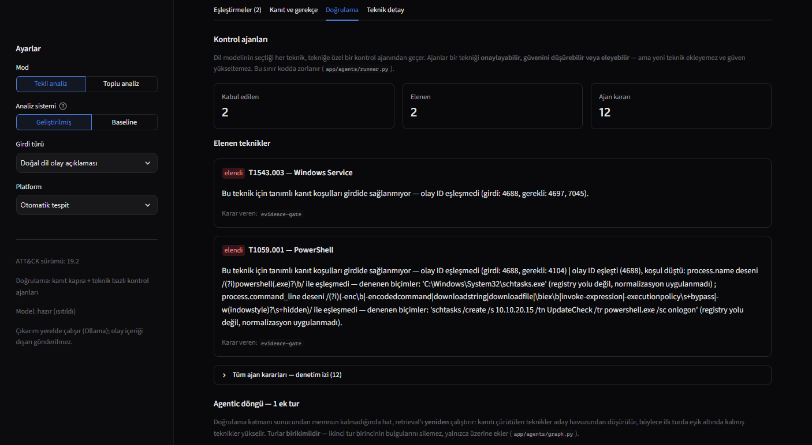
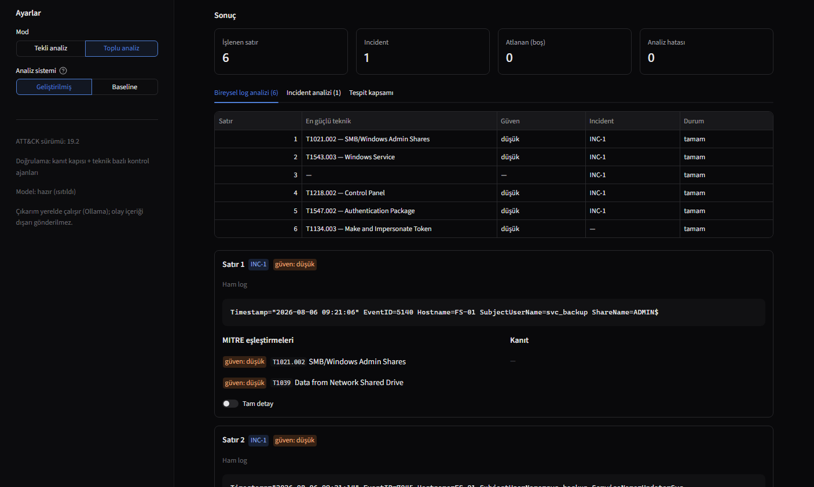
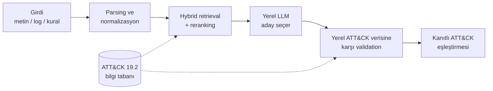

[English](README.md) | [Türkçe](README.tr.md)

# MITRE ATT&CK Teknik Eşleştirme Platformu

Güvenlik olaylarını — doğal dille yazılmış olay açıklamalarını, ham
Windows/Sysmon/QRadar loglarını ve detection kuralı metinlerini — MITRE ATT&CK
taktik, teknik ve alt-tekniklerine eşleştiren, her sonucun arkasındaki kanıtı
gösteren yerel bir LLM + RAG uygulaması.

Retrieval aday önerir; neyin kalacağına validation katmanı karar verir. Her şey
[Ollama](https://ollama.com/) üzerinden yerelde çalışır; güvenlik olay içeriği
dışarıdaki bir LLM API'sine gönderilmez.

**Proje amacı:** Bu proje eğitim ve öğrenme amacıyla geliştirilmiş bağımsız bir
mühendislik çalışmasıdır. Amaç; yerel LLM, RAG, MITRE ATT&CK doğrulaması ve
güvenlik olayı eşleştirme süreçlerini uygulamalı olarak araştırmak, ölçmek ve
geliştirmektir.

**Öğrenme projesi:** Bu proje öncelikli olarak eğitim, öğrenme ve deney amacıyla
geliştirilmiş bağımsız bir mühendislik çalışmasıdır. Analiz pipeline'ı yerel bir LLM
ile birlikte birden fazla retrieval ve doğrulama aşaması kullandığı için her analiz
token ve hesaplama açısından görece maliyetlidir. Amaç hafif veya üretim maliyeti
optimize edilmiş bir çözüm sunmaktan çok bu teknikleri uygulamalı olarak
araştırmaktır.

## Ekran görüntüleri



*Sentetik bir `schtasks /create` logunun tekli analizi: karar, gerekçe zinciri ve
kanıtıyla birlikte eşleşen teknikler.*



*Aynı koşunun Doğrulama sekmesi: modelin önerip kanıtın desteklemediği teknikler,
gerekçeleriyle birlikte eleniyor.*



*Örnek bir CSV üzerinde toplu mod: satır bazlı sonuçlar ve bir incident'e bağlanan
ilişkili satırlar.*

## Ne yapıyor

- **Tekli olay analizi** — serbest metin, ham log satırı veya detection kuralı alır;
  her biri kanıtı, güven skoru ve resmî MITRE tespit ve önleme bilgisiyle birlikte
  ATT&CK teknik ve alt-tekniklerini döndürür.
- **Toplu analiz ve incident korelasyonu** — log dosyası veya QRadar CSV export'u
  alır, her satırı analiz eder ve ilişkili satırları attack chain, zaman çizelgesi,
  IOC özeti, risk skoru, Markdown rapor ve *taslak* QRadar kuralıyla incident'lere
  gruplar.
- **Değerlendirme** — baseline ile geliştirilmiş pipeline'ı karşılaştıran 60
  senaryoluk test seti.

## Mimari



Retrieval yalnızca bir aday havuzu kurar; yerel model bu havuzdan seçer ve her
seçim yerel ATT&CK verisine karşı kodla sınanır. Validation bir tekniği eleyebilir
ama asla ekleyemez. Ayrıntılar: [`docs/architecture.md`](docs/architecture.md).

## Öne çıkan özellikler

- Cross-encoder reranking ile hybrid retrieval (vektör + anahtar kelime araması)
- Revoked ve deprecated teknikler dahil, yerel ATT&CK Enterprise 19.2 verisine
  karşı validation
- Onaylayabilen, güven düşürebilen veya eleyebilen — ama asla ekleyemeyen
  validation agent'ları
- Modelden alınmayan, ölçülebilir sinyallerden hesaplanan güven skoru
- Attack chain, zaman çizelgesi ve risk skoruyla deterministik incident korelasyonu
- Modele yazdırılmayan, doğrulanmış kanıttan kurulan QRadar kural taslakları
- Tamamen yerel çıkarım

## Hızlı başlangıç

[Ollama](https://ollama.com/) kurulu ve çalışıyor olmalı.

```
ollama pull qwen3:8b
ollama pull bge-m3

python -m venv .venv
.venv\Scripts\activate            # Linux / macOS: source .venv/bin/activate
pip install -r requirements.txt
copy .env.example .env            # Linux / macOS: cp .env.example .env

# ATT&CK bilgi tabanı ve index'ler (bir kez, ~30 dk)
python scripts/download_attack_data.py
python scripts/parse_stix.py
python scripts/build_chunks.py
python scripts/build_index.py

streamlit run app/ui/streamlit_app.py
```

Testler `pytest` ile koşulur (1.501 test; public klonda 11'i atlanır). Tam kurulum,
GPU notları ve komut satırı kullanımı:
[`docs/setup-and-usage.md`](docs/setup-and-usage.md) (İngilizce).

## Sonuçlar

ATT&CK Enterprise 19.2 üzerinde kontrollü benchmark, 60 senaryo:

| Metrik | Baseline | Improved |
|---|---:|---:|
| Ortalama hiyerarşik skor | 0.660 | 0.672 |
| Top-1 tam doğruluk | %61,7 | %64,9 |
| Recall@10 | 0.810 | 0.800 |
| Hallucination (uydurma ATT&CK ID) | 0 | 0 |
| Doğru abstention | %100 | %100 |

Yöntem, tüm metrikler ve kategori sonuçları:
[`docs/evaluation.md`](docs/evaluation.md) (İngilizce).

## Bilinen sınırlar

- Zararsız girdilerde sistem alarm üretmiyor ama boş cevap yerine düşük güvenli
  teknik önerileri listelemeye devam ediyor.
- Analiz küçük bir yerel modelle çalışıyor ve tüketici sınıfı bir GPU'da olay
  başına dakikalar sürüyor.
- Detection kural kataloğunda açık kalan eksikler var; bkz.
  [`docs/engineering-notes.md`](docs/engineering-notes.md).
- Arayüz yalnızca Streamlit; API katmanı yok.

## Belgeler

| Belge | İçerik |
|---|---|
| [`docs/architecture.md`](docs/architecture.md) | pipeline diyagramları, tasarım ilkeleri, çalışılmış örnek |
| [`docs/evaluation.md`](docs/evaluation.md) | benchmark yöntemi, tüm sonuçlar, tarihsel koşular, performans |
| [`docs/attack-19.2-migration.md`](docs/attack-19.2-migration.md) | ATT&CK 19.1 → 19.2 veri değişiklikleri ve kontrollü karşılaştırma |
| [`docs/setup-and-usage.md`](docs/setup-and-usage.md) | kurulum, GPU notları, komut satırı, klasör yapısı, gizlilik |
| [`docs/engineering-notes.md`](docs/engineering-notes.md) | yöntem, bulgular, çürütülmüş hipotezler, durum, yol haritası |
| [`docs/`](docs/) `beklenti_*` / `olcum_*` / `sonuc_*` | görev bazlı beklentiler, ölçümler ve sonuçlar (Türkçe) |

## Lisans

MIT — bkz. [LICENSE](LICENSE).
