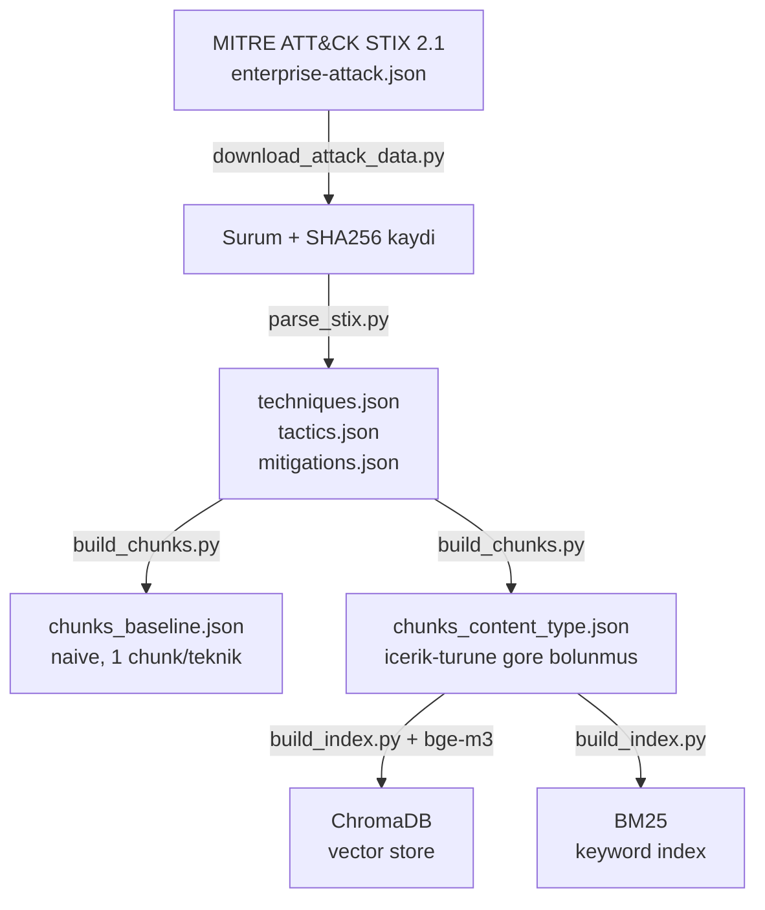
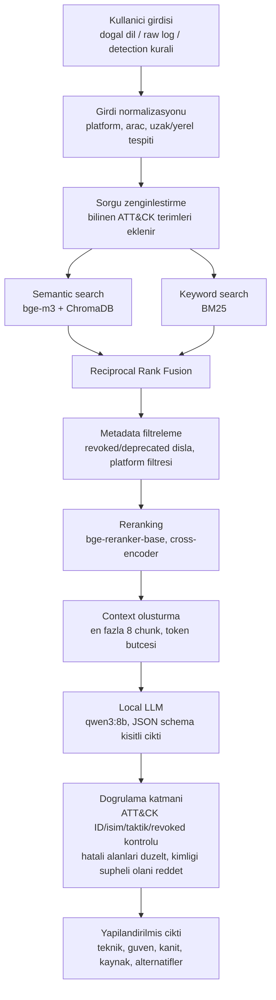
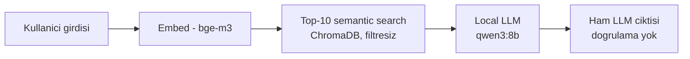
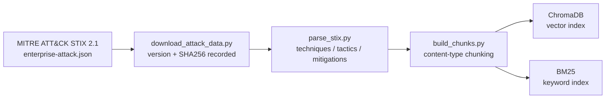
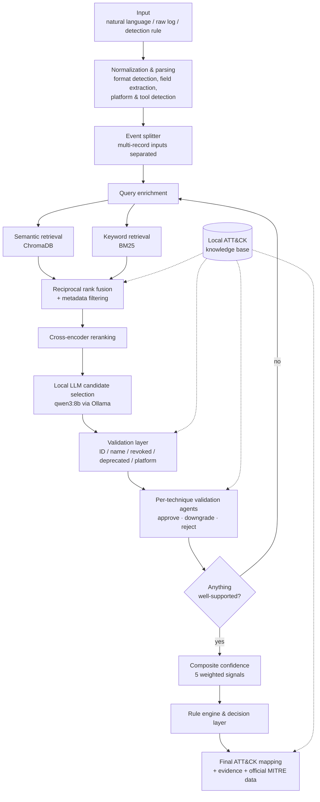
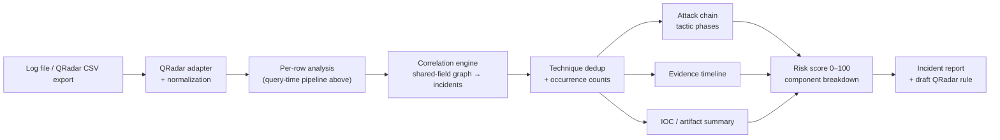
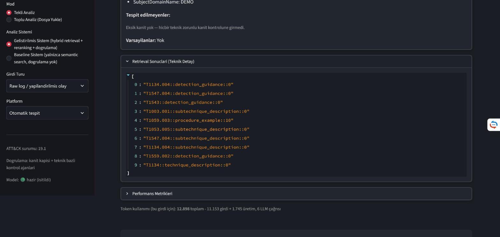
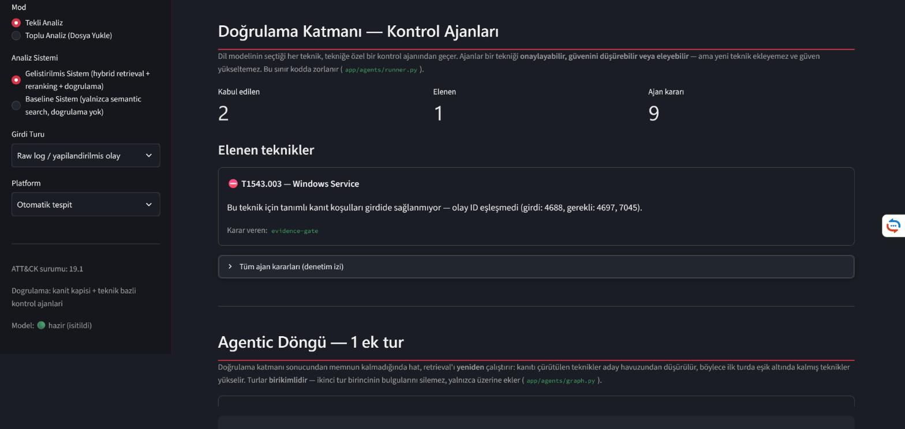
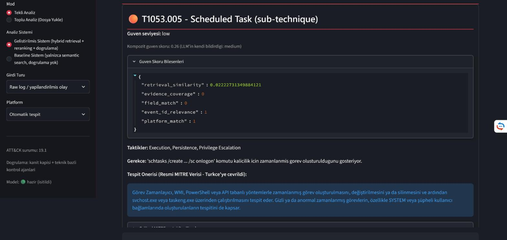
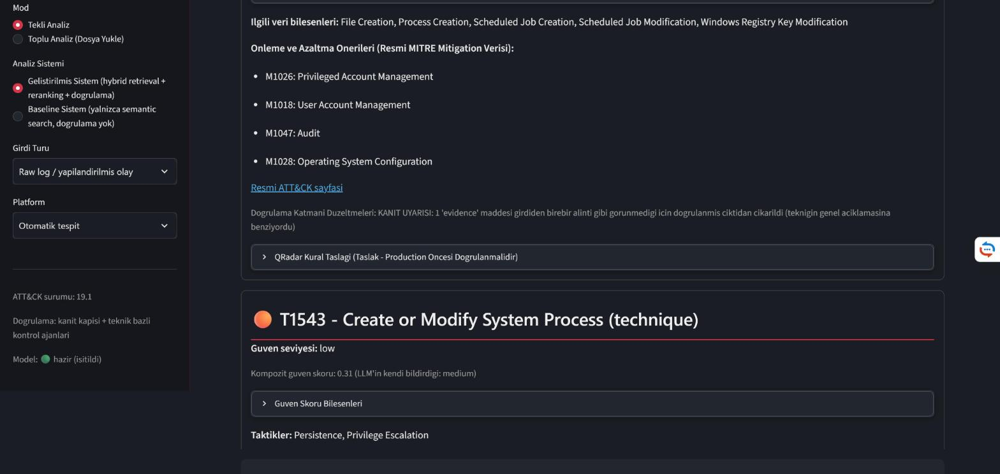

# Sistem Mimarisi

## Veri Hazirlama Hatti (bir kere calisir)



## Sorgu Zamani - Gelistirilmis Sistem



## Baseline Sistem (karsilastirma icin, bilerek basit tutuldu)



## Neden iki sistem?

Dokuman (bolum 33) baseline ile gelistirilmis sistemin olculebilir sekilde
karsilastirilmasini istiyor. `docs/baseline_vs_improved_report.md` bu
karsilastirmanin sonuclarini icerir -- ozetle: naif RAG (baseline), hicbir
retrieval yapmadan sadece LLM'e sormaktan (no-RAG) bile daha kotu sonuc verdi;
yalnizca hybrid retrieval + reranking + dogrulama ile desteklenen gelistirilmis
sistem gercek bir iyilesme sagliyor.

---

> **Below this line (English):** moved from `README.md` on 2026-09-28 when the
> README was shortened — the detailed capability list (*What it does*), the
> current pipeline diagrams, *Key Design Principles* and *Worked Example*. Text
> unchanged; only image and link paths were adjusted for the new location. The
> Turkish diagrams above are the earlier, simpler version and are kept as they
> were.

## Capabilities in detail

**Single-event analysis**

- Local LLM inference via Ollama (`qwen3:8b`), local embeddings (`bge-m3`)
- MITRE ATT&CK Enterprise STIX 2.1 knowledge base, parsed locally (v19.2)
- Hybrid retrieval: ChromaDB vector search + BM25 keyword index, fused with
  reciprocal rank fusion
- Cross-encoder reranking (`BAAI/bge-reranker-base`, CPU by design — see
  [Performance & limitations](evaluation.md#performance--limitations))
- Metadata filtering on platform, `revoked` and `deprecated` status
- Output validation against the local ATT&CK dataset: ID existence, name match,
  revoked/deprecated redirection, platform compatibility
- Per-technique validation agents that can approve, downgrade or **reject** a
  candidate — but cannot add new techniques or raise confidence
- Composite confidence from five measurable signals, shown broken down in the UI
- Optional agentic loop: if validation leaves nothing well-supported, retrieval
  runs a second round

**Bulk analysis and incident correlation** (deterministic, no LLM calls)

- QRadar "Log Activity" CSV export adapter — including the header-less format
  with a tab-delimited payload embedded in one column
- Deterministic correlation engine: log lines become graph nodes, edges are
  formed on shared correlation fields (hostname, user, IPs, process/parent GUIDs
  and PIDs, logon/session ID, service name, file path), producing incidents
- ATT&CK mapping deduplication per incident, with occurrence counts
- Attack-chain view: techniques ordered into canonical Enterprise tactic phases
- Chronological evidence timeline (rows without timestamps are kept, appended
  last, and make no ordering claim)
- IOC / artifact summary: suspicious processes, network connections, downloaded
  files, created services and users, registry changes, credential access
- Transparent rule-based incident risk score (0–100) with a per-component
  breakdown
- Markdown incident report export, and a **draft** QRadar rule built from
  extracted fields and validated mappings (never LLM-written syntax)
- Per-incident chat that answers *data queries* by quoting already-computed
  values rather than recomputing them

**Evaluation**

- 60-scenario benchmark across 10 categories, with baseline / improved / no-RAG
  arms and an ablation of the validation layer — see [`evaluation.md`](evaluation.md)

**Interface**

- Streamlit UI calling the pipeline functions directly (no separate REST layer)

## Current pipeline

**Knowledge base preparation** (runs once):



**Query time:**



**Bulk mode** adds a deterministic correlation stage on top of per-row results:



The knowledge base is built once from the official MITRE ATT&CK STIX bundle; the
downloaded bundle's version and SHA256 are recorded so an index can be traced
back to the dataset it was built from.

At query time the input is first parsed rather than passed to the model as free
text: the format is detected, fields are extracted into a canonical schema, and
multi-record inputs are split so that each event travels the single-event path.
Retrieval then runs twice — dense and lexical — and the two result sets are fused
before metadata filtering and cross-encoder reranking. Only then does the local
LLM choose among the surviving candidates.

Everything after the LLM is code, not generation. The validation layer checks each
proposed ID against the local ATT&CK dataset; per-technique agents apply evidence
requirements and may reject a mapping outright; confidence is recomputed from
measurable signals; and the rule engine and decision layer produce the final
verdict. In bulk mode the correlation, chain, timeline, IOC and risk stages call
no model at all.

## Key Design Principles

**Retrieval produces candidates, not decisions.** Hybrid retrieval and reranking
exist to assemble a candidate pool wide enough to contain the right answer; the
selection and the survival of that answer are separate, later steps.

**The model's confidence is not the system's confidence.** Composite confidence is
computed in `app/validation/confidence.py` from five signals with fixed weights:
retrieval similarity (0.30), evidence coverage (0.30), field match (0.15),
event-ID relevance (0.15) and platform match (0.10). The UI shows the breakdown,
so a technique the model called `medium` can legitimately be presented as `low`.

**Validation can remove, never invent.** Per-technique agents may approve a
candidate, downgrade its confidence, or reject it. They cannot introduce a
technique the retrieval and LLM stages did not produce, and cannot raise
confidence. This limit is enforced in code (`app/agents/runner.py`).

**Mappings are checked against the local ATT&CK dataset.** ID existence and name
agreement are verified; `revoked` techniques are redirected through the STIX
`revoked-by` relationship rather than silently dropped; `deprecated` techniques
are flagged; platform compatibility is checked against the technique's declared
platforms.

**Generated syntax is not trusted.** The QRadar rule draft is assembled in code
from extracted fields and validated mappings. If there is no evidence to build
from, no rule is produced — an empty result is preferred to a plausible-looking
invented one.

**Correlation is deterministic.** Incident grouping, deduplication, attack chain,
timeline, IOC extraction and risk scoring are rule-based functions over previous
stages' output, with no model in the loop, so the same input yields the same
incident structure.

## Worked Example

*Captured on ATT&CK 19.1 with the previous interface; kept as the record of that
run. The README shows current ATT&CK 19.2 screenshots.*

Input (single raw log line, `Raw log / structured event` mode):

```
EventID=4688 Hostname=DEMO-WS-01
NewProcessName=C:\Windows\System32\schtasks.exe
CommandLine="schtasks /create /tn \WindowsUpdateCheck /tr C:\Users\Public\svc-update.exe /sc onlogon /ru SYSTEM"
ParentProcessName=C:\Windows\System32\cmd.exe
SubjectUserName=demo.user SubjectDomainName=DEMO
```

Retrieval returned ten candidate chunks, each tagged with the content type it came
from — `detection_guidance`, `subtechnique_description`, `procedure_example`:



The LLM selected from that pool; validation then ran. **Two techniques were
accepted** (`T1053.005 — Scheduled Task`, `T1543 — Create or Modify System
Process`) and **one was rejected**:



`T1543.003 — Windows Service` was rejected by the `evidence-gate` with an explicit
reason: the evidence conditions defined for that technique are not satisfied by
the input — the event ID does not match (input `4688`, required `4697` / `7045`).
This is the intended behaviour: a service-creation technique should not survive on
a process-creation event.

For the accepted `T1053.005`, composite confidence resolved to **`low` (0.26)**
even though the model reported `medium`, because evidence coverage and field match
both scored 0 while only event-ID relevance and platform match contributed:



The output carries the official MITRE detection guidance and mitigation list for
the technique, plus a link to its ATT&CK page:


