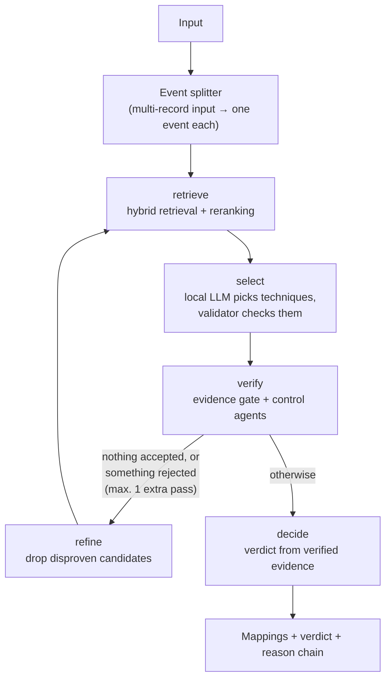
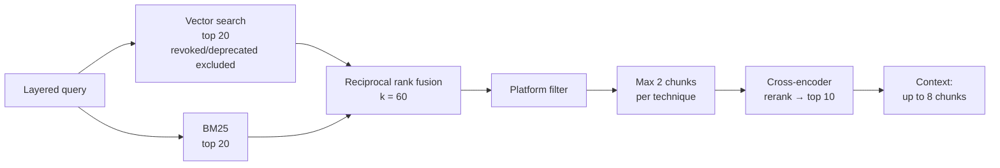

# Technical deep dive

How the MITRE ATT&CK Mapper actually works, for engineers and security
practitioners who want more than the README. Every number and parameter below is
taken from the code or from the measurement documents in this repository; where a
topic already has its own document, this page summarises it and links there.

**Contents**

1. [System architecture](#1-system-architecture)
2. [Local LLM approach](#2-local-llm-approach)
3. [RAG pipeline](#3-rag-pipeline)
4. [ATT&CK mapping](#4-attck-mapping)
5. [Validation layer](#5-validation-layer)
6. [Rule catalogue](#6-rule-catalogue)
7. [Evaluation methodology](#7-evaluation-methodology)
8. [Performance and token/compute cost](#8-performance-and-tokencompute-cost)
9. [Engineering trade-offs](#9-engineering-trade-offs)
10. [Known limitations and future work](#10-known-limitations-and-future-work)

---

## 1. System architecture

The system has two paths that share one analysis core.

- **Single-event path** — one input (free text, a log line or a detection rule) is
  analysed and shown with its evidence.
- **Bulk path** — a log file or QRadar CSV export is analysed row by row with the
  same core, then grouped into incidents by a deterministic correlation engine that
  calls no model.

The core is a small state graph (`app/agents/graph.py`, built with LangGraph):

Two properties of this design matter throughout the rest of the document:

- **Retrieval never decides.** It builds a candidate pool. The model chooses from
  that pool, and everything after the model is code that can remove or downgrade a
  choice but never add one.
- **LangGraph only runs the flow.** The guarantee that a control agent cannot add a
  technique or raise confidence is enforced in `app/agents/runner.py`
  (`apply_decisions`), not by the framework. Replacing the graph with a plain loop
  would keep every safety property.

Diagrams of the knowledge-base build, the query path and bulk mode, plus a worked
example: [`architecture.md`](architecture.md).

---

## 2. Local LLM approach

All inference runs through [Ollama](https://ollama.com/) on the local machine; no
security event content is sent to a hosted API.

| Role | Model | Where it runs |
|---|---|---|
| Technique selection, control agent, chat | `qwen3:8b` | Ollama (GPU if available) |
| Embeddings | `bge-m3` | Ollama |
| Reranking | `BAAI/bge-reranker-base` (cross-encoder) | CPU, on purpose (see §9) |

Generation is made as repeatable as the runtime allows
(`app/llm/ollama_client.py`, `DETERMINISTIC_OPTIONS`):

| Option | Value | Why |
|---|---|---|
| `temperature` | 0 | repeatable output |
| `seed` | 42 | repeatable output |
| `top_p` | 1 | no nucleus truncation |
| `num_ctx` | 6144 | fits 8 GB VRAM next to the embedding model; shared by every call |
| `keep_alive` | 30m | the model stays loaded between analyses |

Two findings shaped this setup:

- **Model load state changes the output, not just the speed.** The same input gave
  a different verdict with a cold and a warm model, so the UI warms the model at
  start-up (`_warm_model` in `app/ui/streamlit_app.py`) and shows whether that
  worked.
- **Structured output is schema-constrained.** The selection call passes a JSON
  schema to Ollama (`MAPPING_RESPONSE_SCHEMA`), so the answer is always parseable.
  For the LLM-based control agent, the *order of fields in the schema* changed the
  model's judgement; the measurement is in
  [`hybrid_agent_findings.md`](hybrid_agent_findings.md).

---

## 3. RAG pipeline

### Knowledge base

Built once from the official ATT&CK Enterprise STIX bundle, currently **19.2**
(`scripts/download_attack_data.py` records the version and SHA-256; the pipeline
reads its version label from `data/metadata/attack_source_metadata.json`).

| | ATT&CK 19.2 |
|---|---|
| STIX objects | 26,086 |
| Technique IDs | 858 (697 live, 149 revoked, 12 deprecated) |
| Content-type chunks | 3,139 |

Techniques are split by content type (`app/ingestion/chunking.py`):
technique/sub-technique description, procedure examples, detection guidance and
mitigations, with a target of about 600 tokens per chunk. Every chunk repeats the
ATT&CK ID and name at the top, so a chunk retrieved on its own still says which
technique it belongs to. A naive one-chunk-per-technique variant is also built for
the baseline pipeline.

Two indexes are built from the same chunks: a ChromaDB vector store
(`bge-m3` embeddings) and a BM25 keyword index. An integrity stamp ties the index
to the chunk file and is checked once per process on the query path
(`app/retrieval/index_integrity.py`), so an analysis never runs on a stale index
silently.

### Query construction

The input is parsed before it is used as a query (`app/normalization/`): the
format is detected, fields are extracted into a canonical schema, and multi-record
inputs are split into separate events. The retrieval query is then **layered**
(`build_layered_query`): discriminating fields first, then the event's meaning in
words (for example "registry value modification" for event 4657), then the raw log
unchanged. The layers are added, never substituted: a measured comparison over the
60 scenarios showed the gain comes from adding a layer, not from dropping the raw
text. An earlier enrichment table that appended technique *names* to the query was
removed after it was shown to hand the answer to retrieval; see
[`engineering-notes.md`](engineering-notes.md#query-enrichment-was-invalidating-its-own-measurement).

### Retrieval, fusion and reranking

All parameters are constants in `app/retrieval/improved_pipeline.py`:

- **Vector and BM25, 20 candidates each**, fused with reciprocal rank fusion
  (`1 / (60 + rank)`), ties broken by chunk ID so the same input always yields the
  same order.
- **BM25 re-ranks but does not add.** The revoked/deprecated filter is applied in
  the vector store's metadata query; a BM25 hit that the vector search did not also
  return is dropped, so only filtered chunks reach the model.
- **Platform filter**, then a **per-technique cap of 2 chunks**. The cap exists
  because one technique's procedure examples once filled 7 of 10 slots and the
  correct technique never reached the model; the measurement is in the comment
  above `MAX_CHUNKS_PER_TECHNIQUE`.
- **Cross-encoder reranking** keeps the top 10. Its scores are normalised
  *within the query* (min-max): raw cross-encoder scores are not comparable
  between queries, so they are never shown as an absolute quality number.
- **Bounded context**: at most 8 chunks are formatted into the prompt.

---

## 4. ATT&CK mapping

The model receives the input and the bounded context and returns, per technique:
the ATT&CK ID, name, object type, tactics, an evidence list, a short reasoning and
its own confidence level (schema in `app/llm/schemas.py`). It may only choose among techniques that
retrieval surfaced; an ID outside the retrieved pool is flagged.

What the model produces is then treated as a *proposal*:

- the **validator** checks it against the local ATT&CK data (§5);
- a **composite confidence** replaces the model's own confidence level;
- the **evidence gate** and **control agents** confirm, downgrade or reject it
  (§5, §6);
- a **decision layer** turns the surviving evidence into a verdict.

The model's reported confidence is kept as `llm_reported_confidence` for
transparency; it does not decide anything.

**Composite confidence** (`app/validation/confidence.py`) is a weighted average of
the signals that are available for that mapping:

| Signal | Weight |
|---|---:|
| Retrieval rank (normalised within the query) | 0.30 |
| Evidence coverage | 0.30 |
| Field match | 0.15 |
| Event-ID relevance | 0.15 |
| Platform match | 0.10 |

Levels: `high` ≥ 0.75, `medium` ≥ 0.50, `low` ≥ 0.25, otherwise `insufficient`.

**Verdict** (`app/validation/decision.py`), one of three classes:
`SUFFICIENT_SUSPICIOUS`, `SUFFICIENT_BENIGN`, `INSUFFICIENT_DATA`. Two independent
paths can make an event suspicious: *Path A* — a technique backed by verified
evidence; *Path B* — write access to an asset whose criticality is `critical` or
`high` (for example the SAM hive; criticality comes from
`config/asset_criticality.yaml`). A known actor/asset pair can suppress Path B but never Path A,
because the actor field can be spoofed. The verdict is computed in its own graph
node *after* verification: it depends on the verified-evidence count, which does
not exist before the gate has run. Every verdict carries a reason chain.

**Multi-event input** is split and each event goes through the whole graph on its
own; the event verdicts are then combined, the harshest one winning. This closes a
path where a harmless record placed next to a malicious one could suppress the
alarm.

---

## 5. Validation layer

Validation has three stages, each able to remove but not to invent.

**1. Validator** (`app/validation/validator.py`), on every proposed mapping:

| Check | Result |
|---|---|
| ID not in the local ATT&CK data | rejected |
| ID revoked | redirected to its `revoked_by` replacement (then re-validated), or rejected if there is none |
| Required evidence for the technique missing from the log | rejected |
| Name, object type, tactics or source URL wrong | corrected, with a note |
| Technique deprecated | kept, with a warning |
| Evidence line not quoted from the input | the line is dropped, with a note |
| ID not in the retrieved pool | kept, with a note |

**2. Evidence gate** (`app/agents/verification.py`) — tests the mapping against the
rule catalogue (§6) on the row the technique came from:

| Situation | Decision |
|---|---|
| No rule for the technique | silent (no opinion) |
| Rule conditions met | confirm |
| Rule requires an event ID, the input has none | abstain — missing data is not missing evidence |
| Input has an event ID, conditions not met | reject |

**3. Control agents**

- Three *deterministic* agents for high-value techniques: `T1053.005` (scheduled
  task), `T1003.001` (LSASS access) and `T1686.003` (host firewall — including the
  check that a firewall *permitting* traffic is not evidence that it was disabled).
- One *general* agent (`DetectionEvidenceAgent`) that reads the technique's own
  ATT&CK detection text and asks the local model whether the input supports it.
  It covers the 697 techniques that have detection text and makes **one LLM call
  per finding**; if the model is unreachable it abstains rather than rejecting.

When several decisions apply to one technique, the harshest wins:
reject > downgrade > confirm/abstain. Every decision is kept with its reason and
shown in the UI's validation tab.

**The agentic loop.** If a pass accepts nothing, or rejects something, the graph
runs retrieval once more with the disproven techniques removed from the candidate
pool, so techniques just below the cut-off can rise (`MAX_PASSES = 1`). Passes
accumulate: the second pass can add findings but cannot remove what the first
accepted.

**Measured effect** (historical ablation on ATT&CK 19.1, 58 scenarios): the agents
lowered the mean hierarchical score from 0.717 to 0.674 and cut the average number
of high-confidence techniques from 1.45 to 0.45. It is a trade-off — fewer confident
wrong answers at the cost of some confident right ones — and is kept for that
reason, not presented as an accuracy gain. Details:
[`evaluation.md`](evaluation.md#validation-layer-ablation-historical-attck-191).

---

## 6. Rule catalogue

`rules/attack_mappings.yaml` holds boolean evidence rules: required and forbidden
event IDs, field conditions (regular expressions on canonical fields, with
`any_of` alternatives) and a minimum event count. A separate table
(`config/rule_field_map.yaml`) records, for every condition, which canonical field
it belongs to and why; a test keeps the two files in lockstep. The rules do not
select techniques — they are the evidence gate's knowledge base (§5).

Two measured properties of the engine:

- **Polarity is explicit** (`app/mapping/polarity.py`): for the impair-defences
  family, "the control ran" (e.g. a firewall *permitted* a connection) can never
  count as evidence that "the control was disabled". This rule was added after a
  similarity-based system produced a firewall-tampering technique 14 times from
  permitted-connection logs.
- **Registry dialects are normalised**: `\REGISTRY\MACHINE\SAM` and `HKLM\SAM` are
  treated as the same key (`config/path_normalization.yaml`).

### K1 — catalogue corrections after the benchmark

> **This work happened after the controlled 19.2 benchmark in §7 and does not
> change its results.** The benchmark was not re-run.

A static scan first measured the catalogue
([`olcum_23_k1_kural_kalitesi.md`](olcum_23_k1_kural_kalitesi.md)); K1 then corrected
part of it in five separately measured steps, each predicted in writing before the
change ([`beklenti_K1_kural_kalitesi.md`](beklenti_K1_kural_kalitesi.md), Turkish):

| Step | Change |
|---|---|
| K1a | Every rule filed under its live ATT&CK 19.2 ID: three rules sat under revoked IDs and could never match; a firewall rule sat under `T1685.005` (*Clear Windows Event Logs* in 19.2), so a correctly chosen log-clearing technique was tested against the firewall rule and removed. A test now checks every rule ID and name against the bundle. |
| K1a′ | The two moved rules got their configuration-event coverage (firewall configuration events for `T1686`; event 7040 for the Event Log service being disabled). |
| K1b | Process-name conditions accept a full path *or* a bare file name; previously a source writing `cmd.exe` instead of `C:\...\cmd.exe` was missed silently. |
| K1c | `T1140` no longer claims `certutil -urlcache`, which is download evidence for `T1105`. |
| K1d | Sysmon/Windows equivalent events added where the fields line up (e.g. Sysmon 1 next to 4688). |

Measurement: an LLM-free replay of the evidence gate over 186 stored records (the
three evaluation arms plus the 60 benchmark scenarios' stored model choices)
changed 13 gate decisions, all of them predicted. These are **gate decisions, not
benchmark scores**. The replay tool (`scripts/measure_k1_side_effect.py`) needs the
private development history and data, so it runs only in the development
repository; its outputs are in `docs/olcum_k1/`.

**Still open:** 12 of 51 rules have no discriminating condition (for example, a
single failed logon counted as brute force needs count and time-window semantics
the engine does not have), and 4 rule/event pairs read a field the event does not
carry.

---

## 7. Evaluation methodology

Full details: [`evaluation.md`](evaluation.md).

- **Benchmark:** 60 scenarios in 10 categories (single clear technique,
  sub-technique required, multiple techniques, raw log, ambiguous input, negative
  examples, platform conflict, prompt injection, deprecated/revoked, Turkish/English
  cross-language), `evaluation/test_scenarios.json`.
- **Scoring** (`app/evaluation/metrics.py`): exact sub-technique 1.0, acceptable
  alternative 0.7, correct parent technique 0.5, right tactic but wrong technique
  0.1, unrelated 0.0. Hallucination rate is the share of returned IDs absent from
  the local knowledge base.
- **Arms:** a deliberately simple baseline (vector search, no validation) and the
  improved pipeline described above.

**The controlled ATT&CK 19.2 run** (2026-09-27): `qwen3:8b` / `bge-m3` /
`BAAI/bge-reranker-base`, temperature 0, seed 42. Scenarios ran in batches of
three, each in a fresh process with the models unloaded first, because a single
60-scenario process exceeded the RAM of the 16 GB test machine. Every stored score
was recomputed from the raw outputs with the unchanged scorer; the result files and
their hashes are in
[`evaluation/results/controlled_attack_19_2/`](../evaluation/results/controlled_attack_19_2/PROVENANCE.md).

| Metric | Baseline | Improved |
|---|---:|---:|
| Mean hierarchical score | 0.660 | 0.672 |
| Top-1 exact accuracy | 61.7% | 64.9% |
| Recall@5 | 0.810 | 0.745 |
| Recall@10 | 0.810 | 0.800 |
| Hallucinated IDs | 0 | 0 |
| Correct abstention (9 applicable) | 100% | 100% |
| Runtime errors | 0 | 3 |

Reading it factually: the improved pipeline has the higher mean score and top-1
accuracy and lower recall; its three errors are one mechanism (an agent trying to
raise a confidence level trips the contract check) and are excluded from its
averages. Negative examples score 0.00 in both arms even though both pass the
abstention check — the two metrics measure different things. There is no repeat
run, so run-to-run variance is unknown.

**ATT&CK 19.1 → 19.2.** The same 60 scenarios were run against both dataset
versions with byte-identical code. The technique catalogue did not change between
the versions; 19.2 adds procedure examples and a few groups and malware. Mean scores
moved by less than one scenario's weight (baseline 0.663 → 0.660, improved
0.681 → 0.672), and without repeat runs no ranking of the versions is made. Details:
[`attack-19.2-migration.md`](attack-19.2-migration.md).

**Benchmark and K1 are separate.** The controlled run above was made on the code
before K1 (§6). Any evaluation of K1's effect would need its own, separately
labelled controlled run.

---

## 8. Performance and token/compute cost

Measured on one machine with an 8 GB GPU, for a single `EventID=4688` line through
the improved pipeline ([`evaluation.md`](evaluation.md#performance--limitations)):

| | Measured |
|---|---|
| Token usage, full analysis | 12,898 (11,153 input + 1,745 output) |
| LLM calls per analysis | 6 |
| Wall-clock latency | 166–185 s |
| Benchmark latency per scenario (19.2 run), mean / median | baseline 20.0 / 19.7 s, improved 63.1 / 44.0 s |

**Why one analysis is this expensive.** The cost is structural, not accidental:

| Stage | Cost driver |
|---|---|
| Parsing and query | one embedding call for the layered query |
| Retrieval | vector search + BM25 over 3,139 chunks |
| Reranking | cross-encoder over up to ~20 candidates, **on CPU** |
| Selection | one LLM call with up to 8 chunks of ATT&CK text as context |
| General control agent | **one LLM call per proposed technique** |
| Agentic loop | when triggered, retrieval, selection and verification run **a second time** |
| Multi-event input | every event runs the whole graph separately |

Logs are also verbose: in one measured log line, 53% of the tokens were field
names rather than discriminating content.

Two observations about the numbers themselves:

- **Token cost is deterministic, latency is not.** Running the same input twice gave
  an identical token count and a different wall-clock time, so latency alone is not
  a useful optimisation signal.
- **The mean latency is dominated by outliers** (one benchmark scenario took 943.7 s),
  which is why the median is reported next to it.

The project is not optimised for cost: the aim was to build and measure each stage,
not to minimise tokens. The obvious targets — shorter canonical field names in the
prompt, fewer agent calls when the rule layer can decide alone — are listed under
future work.

---

## 9. Engineering trade-offs

| Decision | Trade-off |
|---|---|
| Reranker on CPU | On an 8 GB card `qwen3:8b` + `bge-m3` already use ~6.2 GB; a GPU reranker made Ollama evict and reload models and caused timeouts. CPU is slower but stable. With 16 GB+ it can move to `device="cuda"`. |
| `num_ctx` = 6144 | Enough for the bounded context; larger windows compete for the same VRAM, and the value is shared with the chat features. |
| Validation can reject | Fewer confident wrong answers, at the measured cost of some confident right ones (§5). |
| One extra loop pass | Each pass costs a full retrieval + selection + verification; the measured benefit was concentrated in the second pass. |
| Max 2 chunks per technique | Keeps the candidate pool diverse; the cap shortens the list rather than pulling in new candidates. |
| BM25 re-ranks only | Keeps revoked/deprecated chunks out reliably, but BM25 cannot surface a chunk the vector search missed. |
| Deterministic correlation | Same input, same incidents; no model in the bulk grouping, attack chain, timeline, IOC or risk stages. |
| Model confidence ignored | The model's self-report is kept for display only; confidence comes from measurable signals. |
| Rules as a gate, not a selector | The rule catalogue can confirm or reject what the model proposed; with no rule it stays silent, so uncovered techniques are not blocked. |

The method behind these decisions — expectations written before code, measured
outcomes, disproved hypotheses kept — is described in
[`engineering-notes.md`](engineering-notes.md).

---

## 10. Known limitations and future work

**Limitations** (detail in [`evaluation.md`](evaluation.md) and
[`engineering-notes.md`](engineering-notes.md)):

- Negative examples are unsolved: benign inputs raise no alert, but the system still
  lists low-confidence techniques instead of an empty answer.
- One agent-contract error path remains (3 improved-pipeline scenarios).
- The validation layer is a trade-off, not an accuracy gain (§5).
- Rule catalogue: 12 rules without a discriminating condition and 4 rule/event pairs
  remain open (§6); conditions on English message text still fail silently on
  localised Windows logs.
- The small local model often paraphrases instead of quoting evidence; the
  validator drops unquoted evidence lines and the UI shows a warning.
- Token cost is not optimised (§8).
- Streamlit only; no API layer.

**Future work** (none implemented): token and context optimisation starting with
short canonical field names; fewer LLM calls where the rule layer can decide
alone; fixing the validation rejections behind the measured regressions; better
negative-example handling; count and time-window semantics in the rule engine;
source-format independence for message-text conditions; repeated runs to measure
variance; a thin API layer; richer evidence extraction. The full list is in
[`engineering-notes.md`](engineering-notes.md#future-work).
